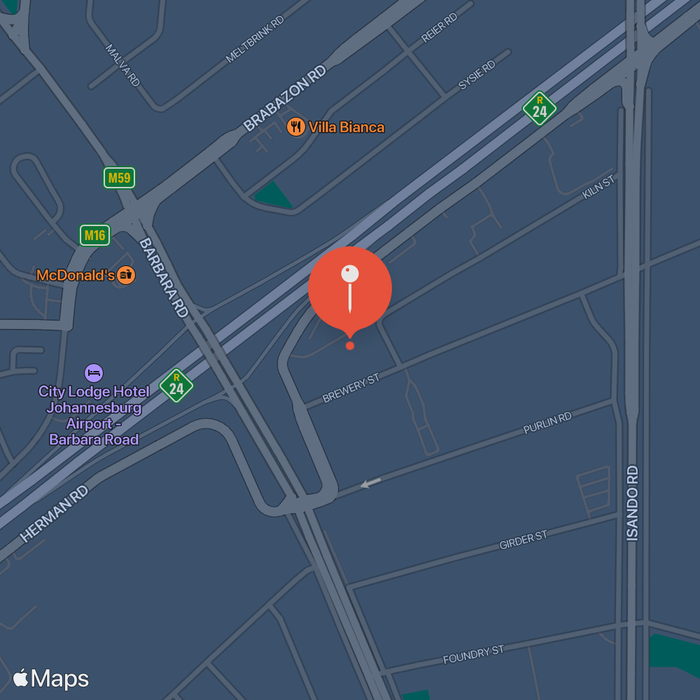
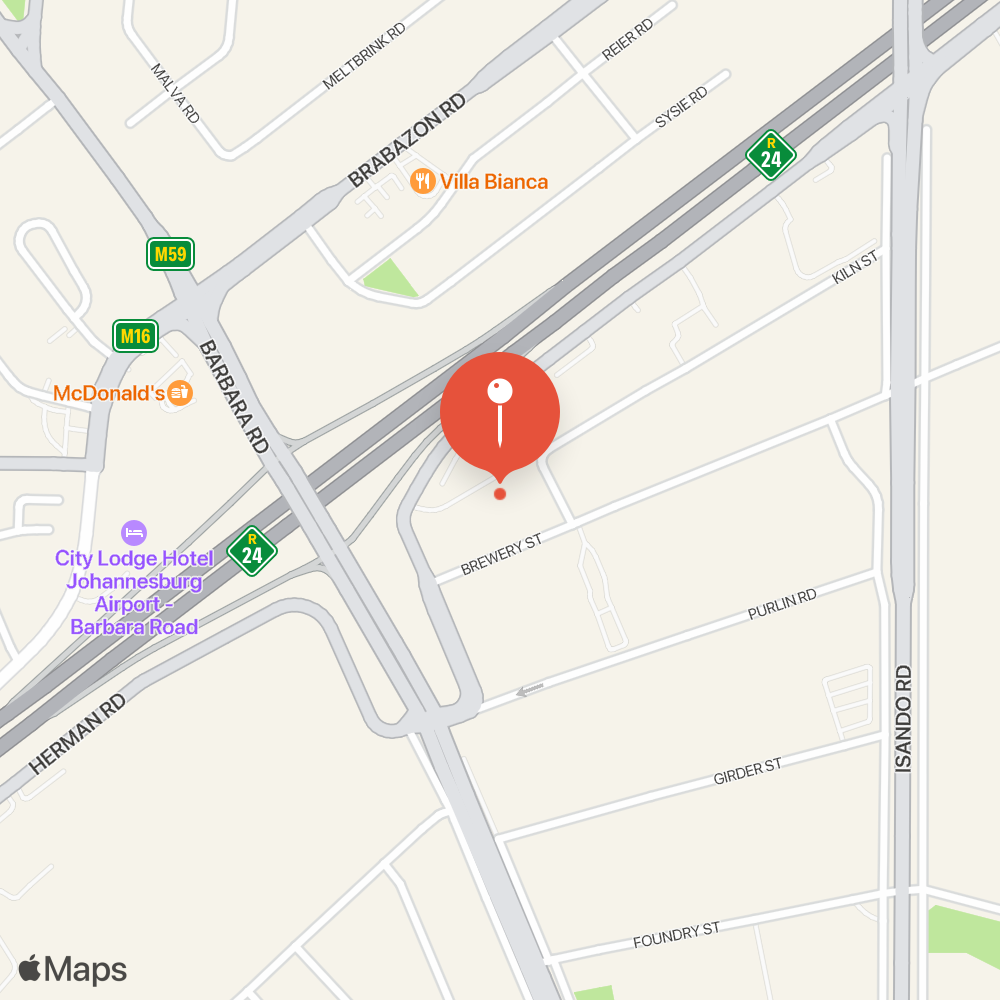

# Apple MapKit .NET Standard 2.0 REST Client

This client library is a reimplementation of Apple MapKit JS to enable its use in .NET projects. For more information, refer to https://developer.apple.com/maps/web/. 

## Usage
Register and configure the service with the `AddMapKitService` extension method.
```c#
.AddMapKitService(options =>
                {
                    options.TeamId = "YourTeamId";
                    options.KeyId = "YourKeyId";
                    options.PrivateKeyContent = File.ReadAllText("PrivateKeyFile.p8");
                })
```

Inject or resolve the client service.
```c#
var mapkitClient = serviceProvider.GetService<IMapKitClient>();
```

Have fun!
```c#
var snapshot = mapkitClient.CreateSnapShotUrl(latitude, longitude, colorScheme);
// https://snapshot.apple-mapkit.com/api/v1/snapshot?center=-26.13778%2C28.19756&z=16&t=standard&scale=2&size=500x500&poi=1&colorScheme={colorScheme}&annotations={annotations}&teamId={teamId}&keyId={keyId}}&signature={signature}
```
#### Dark Colour Scheme

#### Light Colour Scheme


```c#
var places = await mapkitClient.PlacesForGeoCode(latitude,longitude);
```
```json
{
    "center": {
        "lat": -26.13779,
        "lng": 28.197698,
        "geocode": "-26.13779,28.197698"
    },
    "displayMapRegion": {
        "southLat": -26.142281576420597,
        "westLng": 28.192694780405755,
        "northLat": -26.1332984235794,
        "eastLng": 28.202701219594243
    },
    "name": "5 Brewery Street",
    "formattedAddressLine": "5 Brewery Street Kempton Park GP 1601 South Africa",
    "formattedAddressLines": [
        "5 Brewery Street",
        "Kempton Park",
        "GP",
        "1601",
        "South Africa"
    ],
    "administrativeArea": "Gauteng",
    "subAdministrativeArea": "East Rand",
    "administrativeAreaCode": "GP",
    "locality": "Kempton Park",
    "postCode": "1601",
    "subLocality": "Isando",
    "thoroughfare": "Brewery Street",
    "subThoroughfare": "5",
    "fullThoroughfare": "5 Brewery Street",
    "areasOfInterest": [],
    "dependentLocalities": [
        "Isando"
    ],
    "country": "South Africa",
    "countryCode": "ZA",
    "geocodeAccuracy": "ADDRESS_PARCEL",
    "timezone": "Africa/Johannesburg",
    "timezoneSecondsFromGmt": 7200,
    "placecardUrl": "https://maps.apple.com/place?q=5%20Brewery%20Street&address=5%20Brewery%20Street,%20Kempton%20Park,%20GP,%201601,%20South%20Africa&ll=-26.13779,28.197698&lsp=7618",
    "iso3166": {
        "countryCode": "ZA",
        "subdivisonCode": "ZA-GP"
    }
}
```


## Useful links

* [Documentation](https://developer.apple.com/documentation/mapkitjs)
* [MapKit JS Dashboard](https://maps.developer.apple.com/)
* [Snapshots Studio](https://maps.developer.apple.com/snapshot)